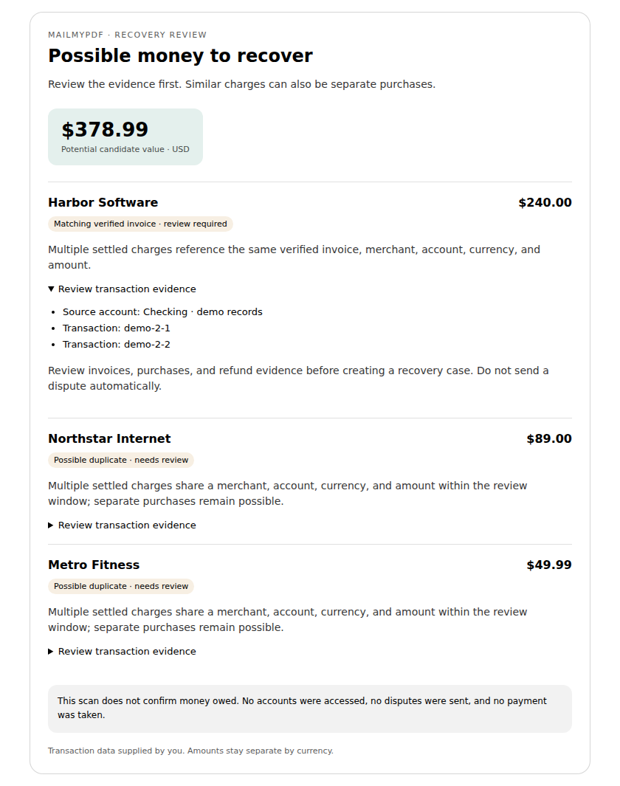

# Recovery review and governed provider actions

The saved-case follow-up (connector **0.15.0**, 2026-10-04) adds a portable recovery workspace to the four existing case tools. It reopens cases, displays owned evidence labels and deadlines, and uses explicit, revision-bound lifecycle controls. The confirmed-outcome form requires supporting linked evidence and separates actual recovered value from screening candidates. See [case-app verification and screenshots](verification/recovery-case-app-ecc.md). It is locally verified with the actual MCP handler in a synthetic Chromium host; production ChatGPT verification and hosted migration remain pending. It introduces no provider activation or replacement workflow execution UI.

Implemented on 2026-10-04 in the existing MailMyPDF packages and connector. This is the first executable recovery-review slice, not a replacement workflow engine or a production-enabled autonomous agent.

## Customer journey implemented in the host

An authenticated chat user can supply transaction records to `scan_recovery_candidates`. The existing MCP handler returns a deterministic scan and a portable review card. The card shows candidate values separately by currency, the merchant, original transaction IDs, confidence, and evidence requirements. It contains no sending, approval, payment, or bank-connection controls.

The scan groups settled debits by account alias, normalized merchant, currency, amount, and verified invoice identity. Without invoice evidence, a group is limited to a 48-hour window anchored at its first charge. Pending authorizations, reversals, and explicitly refunded charges are excluded; partial refunds on either charge reduce the net candidate value. Separate purchases remain possible. The result is screening evidence, not an entitlement or guaranteed recovery.

The scan accepts at most 2,000 supplied records and rejects unsupported fields. Scanning alone does not persist transactions or access bank accounts. After explicit user confirmation, `save_recovery_case` recomputes a selected candidate and saves its related records as unverified provenance. `get_recovery_case`, `list_recovery_cases`, and `update_recovery_case` resume the owned outcome lifecycle using optimistic revisions. Resolution requires explicit user confirmation and already-linked owned document evidence. `invoiceId` and `reversesTransactionId` must come from evidence, not inference. After reviewing evidence, chat can find an existing certified workflow or prepare an ordinary letter through the existing exact-document review process. The scanner itself creates no matter and sends no correspondence.

Example tool arguments, using synthetic data:

```json
{
  "transactions": [
    { "id": "demo-1", "accountId": "Checking alias", "merchant": "Northstar Internet", "amountMinor": 8900, "currency": "USD", "postedAt": "2026-10-01T12:00:00Z", "state": "settled", "kind": "debit" },
    { "id": "demo-2", "accountId": "Checking alias", "merchant": "Northstar Internet", "amountMinor": 8900, "currency": "USD", "postedAt": "2026-10-02T12:00:00Z", "state": "settled", "kind": "debit" }
  ]
}
```

That input yields one possible duplicate worth 8,900 USD minor units, requiring review. It does not establish that $89 is owed.

Browser evidence uses synthetic demonstration records only:



[Phone rendering](verification/recovery-review-mobile.png) was checked at 390px with no horizontal overflow. Desktop was checked at 840px. Both had zero JavaScript page errors, and the evidence disclosure expanded successfully. This verifies the actual HTML resource in Chromium, not its rendering inside a deployed ChatGPT or Claude host.

## Shared execution substrate

| Component | Implemented behavior | Activation boundary |
| --- | --- | --- |
| `@mailmypdf/intelligence` recovery scanner | Deterministic duplicate screening, refund handling, currency separation, evidence identities | Connected to the app's authenticated MCP handler; needs ordinary deployment to reach hosted clients |
| `@mailmypdf/document-intelligence` Docling provider | Native Serve v1 request/response, API key, text/pages/tables, provenance, partial-conversion warning, bounded bytes and response timeout | Host must select the provider and provision its HTTPS service; no live service check performed |
| `@mailmypdf/agent-runtime` governed executor | Authenticated ownership callback, scope policy, canonical SHA-256 approval identity, atomic execution claim, receipt, uncertain-write review | Supabase store and owned authorization callbacks implemented; exact-action human approval route and provider registration still required |
| Gmail actions | Native search/read/draft/send endpoints; MIME encoding; scoped, owner-bound credentials; safe response and redirect handling | Package bindings only; no OAuth flow, token vault/refresh, host registration, or live send enabled |
| Case goals | Private owner-bound outcome lifecycle, linked evidence/matters/actions, explicit evidenced resolution | Durable database repository and four authenticated MCP lifecycle tools implemented; migration/deployment required, no customer dashboard added |
| Trigger HTTP client | Existing `TriggerTaskClient` contract implemented using one registered task's REST trigger endpoint | Requires deployed worker, scoped secret, durable run/checkpoint wiring, dispatch reconciliation, and host configuration |

The existing `ToolRegistry`, workflow registry, auth handler, and mailing approval/payment boundaries remain the owners of their respective responsibilities. No competing tool registry or bespoke workflow execution UI was added. No paid model defaults changed.

### Approval and uncertain effects

`GovernedActionExecutor.review()` authorizes the request and returns its fingerprint. Trusted server code records human approval of that exact fingerprint. `invoke()` loads approval from trusted storage and rejects changed identity/input, expiry, revocation, wrong ownership, or missing scopes. Approval validity is checked after the asynchronous lookup. Input is snapshotted before awaits.

The store must atomically claim the owner/idempotency-key pair. Concurrent calls return the existing operation; changed payloads conflict. A successful provider receipt is retained. An ambiguous external write becomes `needs_review` and cannot automatically repeat. If receipt persistence fails after the provider call, the surviving `running` claim blocks a resend. Gmail Message-ID is deterministic for correlation; it is not a Gmail exactly-once guarantee.

`MemoryActionExecutionStore` is explicitly a test/development reference, never a production default. `createRecoveryActionStore` implements durable unique owner/key claims and optimistic terminal updates. The migration checks ownership, current Gmail policy/scopes, approval expiry/revocation, exact review identity, and immutable terminal receipts. Public recovery tables allow authenticated owner reads only; server code writes through owner-filtered service-role operations. Private credential references have no client read grant. Approval must come from the authenticated human-review route, not caller-provided JSON. Provider connection IDs must have immutable ownership and account identity; token refresh must preserve that identity. Existing packet approvals do not automatically approve Gmail messages.

Gmail evidence is labeled `untrusted-evidence`: message content must never become agent instructions. The current email binding supports plain text and simple recipient addresses; it does not add attachments, bulk sending, arbitrary raw MIME, or HTML execution.

### Provider configuration

Docling defaults to `protocol: "serve-v1"` and maps a service root to `/v1/convert/source`. Supply `apiKey` for `X-Api-Key`; the existing `authorizationHeader` option remains available. A custom pre-existing wrapper must explicitly use `protocol: "legacy"`. Native HTTP 200 responses with failed conversion status are rejected. Missing text provenance stays unlocated instead of receiving a fabricated page number.

`TriggerHttpTaskClient` takes `registeredTaskId`, `secretKey`, an optional HTTPS root endpoint, and optional timeout/fetch injection. Its payload is `{ taskId, payload }` inside the Trigger request. The deployed task must route only allowed internal task identities and reload authoritative owned run/action state. Trigger's idempotency key deduplicates dispatch; it does not protect an arbitrary external write inside a retried worker. Consequential actions still require the governed executor and durable claims.

Provider contracts checked against primary documentation:

- [Docling Serve](https://github.com/docling-project/docling-serve)
- [Gmail MIME and send/draft API](https://developers.google.com/workspace/gmail/api/guides/sending)
- [Trigger task REST API](https://trigger.dev/docs/management/tasks/trigger)

## Verification

Use Node 24 in this environment. The repository pins pnpm 9.10.0. Dependencies were installed with lifecycle scripts disabled because the unrelated ONNX runtime install attempted an unavailable GPU package download. The initial review slice changed no dependencies. The persistence slice adds the agent-runtime workspace dependency, pinned PGlite 0.5.8 for local database tests, and the agent-runtime prebuild filter. The pnpm 9 frozen-lockfile check passes. Direct Node/TypeScript commands avoided an installed pnpm 12 wrapper trying to reinstall the workspace from nested build scripts.

| Check | Result |
| --- | --- |
| `packages/agent-runtime`: `node --import tsx --test src/*.test.ts` | 53/53 |
| `packages/document-intelligence`: `node --import tsx --test tests/*.test.ts` | 23/23 |
| `packages/intelligence`: `node --import tsx --test tests/*.test.ts` | 539/539 |
| App MCP recovery, card, connector, transport, launch-readiness, conversational prompt tests | 66/66 |
| Root `node node_modules/typescript/bin/tsc -b` | Clean |
| Agent-runtime and document-intelligence `tsc --noEmit` | Clean |
| App `node ../node_modules/vite/bin/vite.js build`, then SSR cycle fixer | Clean; no runtime-helper cycles |
| Actual Chromium resource render at desktop/phone widths | Passed; screenshots above |
| App JavaScript tests | 674/675; existing scheduler-gap assertion fails |
| App TypeScript tests | 333/336; existing workflow inventory/registry assertions fail |
| Standalone app `tsc --noEmit` | 18 existing diagnostics; identical to untouched main under the same installed dependencies |

The remaining broad-check failures were reproduced in a separate unchanged clone at `4439147`. The missing checkout-instruction assertion also failed on unchanged main; restoring the instruction in this slice fixes it. Scheduler tests still list `scheduled-mailings` as an unaccepted scheduling gap; workflow tests expect 441 identities while the actual canonical registry has 449. These were not hidden by changing their assertions.

No hosted deployment, OAuth grant, bank connection, real Docling conversion, Trigger task invocation, Gmail send, payment, or mailing was performed. Package-level provider tests use injected responses.

## Persistent recovery cases and action stores

The follow-up slice adds migration `20261004085640_recovery_goals_and_governed_actions.sql`, four owned public tables for goals/connections/approvals/executions, and one private table containing only external encrypted-vault references. Raw OAuth tokens are not stored in these tables. Approval proposal bytes and review identity are immutable; approved metadata must include the authenticated owner, confirmation timestamp, and expiry within 24 hours. An approved proposal is not an executable connector tool.

Saved cases begin in intake. Activate, attach evidence, link an existing owned matter, wait, resume, cancel, and evidenced resolution use exact expected revisions. Overdue waiting cases can still receive evidence. Candidate source records are immutable and unverified; their supplied invoice/refund links never become authenticated document evidence automatically. Saving is deduplicated by owner/retry key and a canonical request hash. A changed request using the same key returns a conflict. Scanner-accepted timestamps are normalized before storage.

The durable action adapter implements the existing `ActionExecutionStore`; the owned authorizer implements `ActionAuthorization`. Hosts must invoke these through `GovernedActionExecutor`, whose registry policy binds the exact input fingerprint. The database rechecks the current supported Gmail policy and scopes while locking the connection at claim time. Unknown tools/policy versions fail closed. These adapters are server-only exports; the MCP catalog exposes no Gmail-send, approval, token, or connection-provisioning tool.

See [ECC verification evidence](verification/recovery-persistence-ecc.md) for commands, observed RED/GREEN checkpoints, coverage, and remaining host-wide failures. The migration has only run in local PGlite PostgreSQL 18.3, not in the hosted Supabase project. PGlite validates actual SQL constraints, role privileges, RLS, and triggers but has a single database connection; it does not establish hosted PostgREST behavior, multi-process race behavior, or production migration compatibility.

## Next implementation

Apply and verify the migration in the intended Supabase environment, including advisors and schema regeneration against the hosted version. Build the exact-action human review route and encrypted credential-vault/OAuth provisioning before registering Gmail actions. Preserve the same owned execution claims in a deployed Trigger worker and add interrupted-action receipt reconciliation. Reconcile the documented scheduler/inventory/typecheck baseline failures before calling broader autonomy production ready. No production migration, deployment, OAuth grant, real email, payment, or mailing was performed in this slice.
