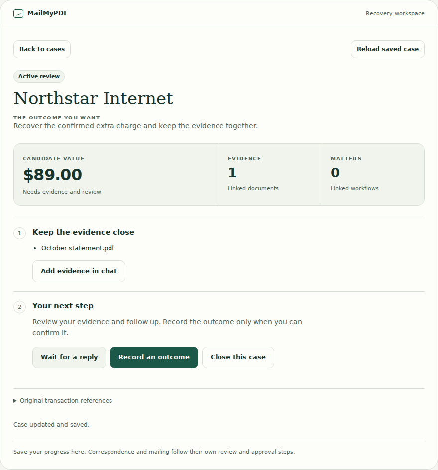

# ECC verification — saved recovery case app

Date: 2026-10-04. Repository: `mycomind4-arch/mailmypdf-all`, existing main working copy. Connector **0.15.0**, still **38 tools**, now **3 static MCP App resources**.

The existing save/get/list/update recovery tools now open an interactive case view: reopen, review named evidence/source references, start/resume, wait with a deadline, explicitly close, or record an actual outcome with supporting evidence. Candidate value and confirmed recovered value remain separate. No new workflow execution engine or provider execution is added.



## ECC and protocol guidance

Applied Everything Claude Code `tdd-workflow`, `security-review`, `mcp-server-patterns`, `verification-loop`, and `browser-qa`, read at `ef648e01899ba3e8dc6371642deaaf64b4477775`. Source: https://github.com/affaan-m/everything-claude-code. Used the existing Node/Supabase SDK harness and actual Chromium; no new paid harness or model default.

Checked the primary [OpenAI UI guide](https://developers.openai.com/plugins/build/chatgpt-ui), [OpenAI bridge reference](https://developers.openai.com/plugins/reference), [MCP Apps specification](https://github.com/modelcontextprotocol/ext-apps/blob/main/specification/2026-01-26/apps.mdx), and current Supabase SDK query documentation. The app uses negotiated parent-only JSON-RPC, result notifications, safe theme updates, intrinsic-size reporting and teardown acknowledgement. A bounded `window.openai.callTool` alias supports legacy ChatGPT hosts.

| Local RED checkpoint | Observed failure | GREEN checkpoint |
| --- | --- | --- |
| `014672a` | Missing controller/evidence adapter, UI linkage and resource | `f43fa29`: initial 20 checks pass |
| `0aa2058` | Pending-deletion evidence available; legacy call hangs; failed reload permits edits | `92a7338`: 24 checks pass |
| `7a4a790` | Real iframe sandbox blocks native form submission; waiting journey times out | `279aa62`: button-driven controls pass browser journey |
| `4871509` | Host theme ignored; cancelled tool leaves old case visible | `9e4a824`: lifecycle checks and expanded coverage pass |

These are local checkpoints. GitHub receives the verified final tree on existing remote main, keeping failing intermediate tests off the Lovable-connected branch.

## Verification

Node 24.19.0, TypeScript 5.9.3, Chromium Headless Shell 151.0.7922.34, axe-core 4.10.3.

| Gate | Result |
| --- | --- |
| Focused UI/evidence/service + MCP connector/schema/scan | **93/93** |
| New controller/evidence coverage | **97.58% lines / 84.15% branches / 91.30% functions** |
| Controller alone | **97.41% lines / 83.59% branches / 90.63% functions** |
| Evidence adapter alone | **100% lines / 90.91% branches / 100% functions** |
| Prompt and transport neighbors | **8/8** |
| Launch contract and schema sync | **10/10**, checks all 3 resources without changing private cases |
| Generated source check | **PASS**: `node scripts/build-recovery-case-app.mjs --check` |
| App Vite build and SSR cycle fixer | **PASS**, no runtime-helper cycles |
| Root `tsc -b` | **PASS** |
| New module/test/browser-harness lint | **PASS** |
| Shared step-workflow guard | **PASS**, zero new violations |
| Full app JavaScript | **675/676**; existing unscheduled-job acceptance failure |
| Full app TypeScript tests | **382/385**; existing 3 inventory/registry failures |
| Standalone app types | **18 existing diagnostics**, zero new case-app diagnostics |

The broad failures retain the documented baseline: `scheduled-mailings` is missing from accepted unscheduled-job gaps; workflow tests expect 441 identities while the registry contains 449. Standalone diagnostics concern existing design-system resolution, route typing, scheduler/nullability, generic checkout and buffer types. They are not suppressed. Modified pre-existing server files also retain formatting debt; the lint pass covers new modules and harness. Direct Node commands avoided the runtime's newer pnpm wrapper trying to reinstall existing dependencies.

Focused command from `mailmypdf/`:

```bash
node --experimental-test-module-mocks --import tsx --experimental-test-coverage \
  --test-coverage-include='**/src/lib/mcp/recovery-case-client.ts' \
  --test-coverage-include='**/src/lib/mcp/recovery-case-evidence.server.ts' \
  --test tests/recovery-case-ui.test.ts tests/recovery-case-evidence.test.ts \
  tests/mcp-recovery-cases.test.ts tests/recovery-case-service.test.ts \
  tests/mcp-recovery-scan.test.ts tests/mcp-recovery-ui.test.ts \
  tests/mcp-connector.test.ts tests/mcp-tool-schema.test.ts
```

## Actual browser evidence

`tests/browser/recovery-case-browser.mjs` imports a loopback-only synthetic host in the same process and displays the real generated resource in an iframe with `allow-scripts allow-same-origin`, without `allow-forms`. App calls pass through the **actual MCP handler and recovery lifecycle service**, with synthetic authentication, in-memory persistence and the real Supabase SDK with injected metadata responses. No real database/provider is contacted.

Passed: list → reopen → keyboard start → explicit evidence conversation handoff → owned evidence attachment → waiting deadline → resume; missing confirmation/evidence and excess precision block updates; exact **$89.00** resolution saves with linked evidence; concurrent revision conflict blocks edits without retry until reload, followed by confirmed closure.

Widths **1280/768/390px** have no horizontal overflow. Dark mode, reduced motion, focus placement, keyboard activation and intrinsic resizing were exercised. No page/console errors or failed requests. axe reported **zero WCAG A/AA violations** in four states. The focused form has one **incomplete color-contrast check**, retained in `results.json`; it is not an automated pass. Screenshot inspection and declared-color calculations give 13.12:1 form text, 5.88:1 help text and 8.13:1 focus outline contrast. This supplements that incomplete check, not a complete manual accessibility audit. No prior visual baseline or field Core Web Vitals are claimed.

Artifacts: [results](recovery-case-browser/results.json), [desktop list](recovery-case-browser/desktop-list.png), [desktop detail](recovery-case-browser/desktop-active.png), [tablet](recovery-case-browser/tablet-active.png), [phone](recovery-case-browser/mobile-active.png), [confirmation](recovery-case-browser/mobile-confirmation.png), [confirmed outcome](recovery-case-browser/mobile-confirmed.png), [dark mode](recovery-case-browser/mobile-dark.png).

Re-run from `mailmypdf/` with externally installed Playwright/Chromium and local axe-core:

```bash
PLAYWRIGHT_MODULE=/absolute/path/to/playwright/index.mjs \
CHROMIUM_EXECUTABLE=/absolute/path/to/chrome-headless-shell \
AXE_SOURCE=/absolute/path/to/axe.min.js \
node --experimental-test-module-mocks --import tsx tests/browser/recovery-case-browser.mjs
```

Optional browser dependencies are not production dependencies; a normal installed Playwright resolves without `PLAYWRIGHT_MODULE`. Screenshots default beside this report. Full Chrome could not start under runtime socket restrictions; one-process headless shell succeeded. The CDN installer returned an invalid archive, so the matching official Google Chrome for Testing headless-shell distribution was used.

## Security review and activation limits

Labels come only from owner-filtered, already-linked secure-document metadata; storage paths are not selected. Missing/deleted/pending-deletion records are unnamed and unavailable. Scanning documents cannot be selected as confirmation evidence in the app. No provider credentials, fetches, external assets, cookies, local storage or HTML injection are introduced. Text uses `textContent`. The server remains the ownership/transition/revision authority.

Both tool bridge paths time out at 15 seconds. Failures, mismatched receipts and uncertain updates block edits until an explicit successful reload. Double clicks do not duplicate pending calls. New host results invalidate old responses and confirmations; cancellation/teardown cannot restore stale results. Evidence handoff is an explicit user-button conversation message, not third-party correspondence.

**Implemented and locally verified; not deployed or production verified.** Hosted recovery migration, real PostgREST/RLS, ChatGPT's production host, OAuth refresh, encrypted provider provisioning, exact-action approval, worker activation and real sends/payments/mailing remain unverified or pending. This slice changes no schema and performs none of those live actions. Waiting deadlines are saved metadata, not automatic reminders. Transaction provenance remains supplied and unverified.
